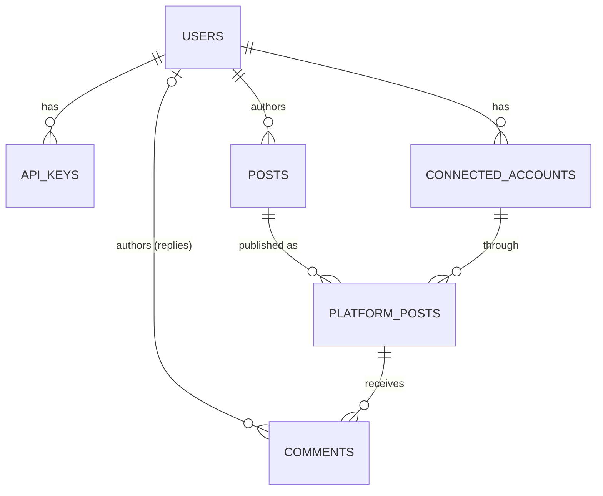

# Database schema

Terms in **bold** are defined in [`../CONTEXT.md`](../CONTEXT.md). Design rationale for the non-obvious choices lives in [`adr/`](./adr/). Column-level truth lives in [`../src/db/schema.ts`](../src/db/schema.ts) — this doc explains *why*, the code explains *what*.

## Notes

**`users` and `posts` already exist in the host scheduling system.** Declared in our schema so the take-home is runnable end-to-end; the comment system references them by `id` and doesn't touch their other columns.

**`platform_posts.last_polled_at` and `sync_cursor`** are the two columns this feature adds to an existing table. `sync_cursor` is the opaque pagination token the platform hands back on each poll — we store it and echo it on the next call. Used by both platforms: TikTok's every-5-min poll and Instagram's hourly reconcile safety net.

**`comments` is one table for both third-party comments and our replies.** `author_user_id` distinguishes: null = scraped from the platform, set = our user wrote it.

**Threading** is a self-reference: `comments.parent_comment_id` → `comments.id`, nullable. Null = top-level comment; set = reply to another comment. No hard-coded depth limit. (Not drawn in the diagram — Mermaid renders self-loops poorly.)

**`comments.platform_comment_id` is nullable** — null means "our reply, not yet accepted by the platform." Sender worker picks up nulls and retries until the POST succeeds and fills it in. Third-party comments always have one at insert.

**`comments.send_status` and `send_error`** track outbound-reply state. `send_status` is `pending | sent | failed` for our replies, always `sent` for third-party comments. `send_error` is null unless `send_status = failed`, in which case it holds the platform's error text so the client can surface it.

**Unique constraint** on `(platform_post_id, platform_comment_id)` makes sync idempotent — replaying the same webhook or poll page can't create duplicates. Postgres treats multiple NULLs as distinct, so pending replies coexist fine.
